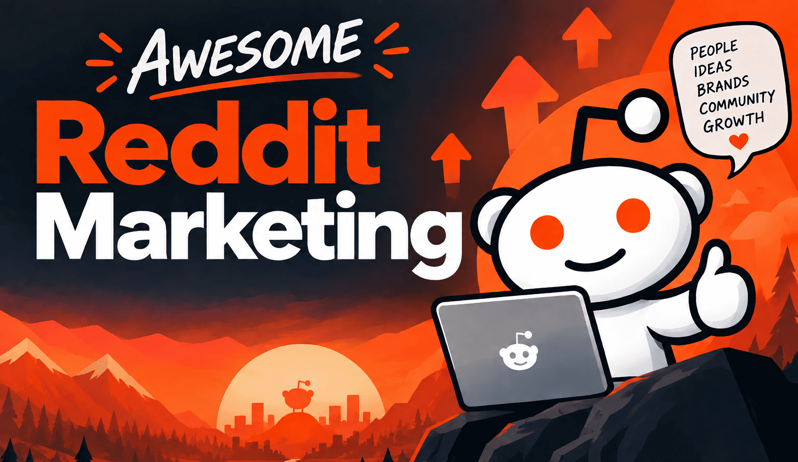

    	

_**TL;DR: This is a curated list of guides, resources, case studies and everything else about marketing on Reddit.**_

   

## 🦊 Reddit Marketing 101:
- [How to Use Reddit for Business](https://foundationinc.co/lab/reddit-b2b-brands)
- [Understanding the Reddit Mod: A Marketer’s Guide]( https://foundationinc.co/lab/marketers-guide-reddit-moderators)
- [How to Get Karma on Reddit: A Beginner’s Guide](https://foundationinc.co/lab/get-karma-on-reddit)
- [How a Branded Persona Account Unlocks Real Brand Possibilities](https://foundationinc.co/lab/reddit-persona-accounts)
- [Structuring a Reddit Marketing Funnel](https://spacestationlabs.ai/blog/structuring-reddit-marketing-funnel)
- [Measuring Organic Reddit Marketing Performance](https://spacestationlabs.ai/blog/measuring-reddit-marketing-performance-kpis)

   

## 📝 How To Grow Your Subreddit:
- [5 reasons to create subreddit](https://www.annsmarty.com/p/5-reasons-to-create-a-dedicated-subreddit)
- [How to Build and Scale a Brand Subreddit](https://www.withkarmic.com/how-to-build-a-brand-subreddit)
- [How to start and grow a subreddit for B2B SaaS](https://www.hackthealgo.com/p/how-to-start-and-grow-a-subreddit)

   

## 📣 Ask Me Anything Strategy:
- [AMA session workbook](https://olenabomko.notion.site/Ask-Me-Anything-AMA-sessions-2a1bf9c31de980059d9dc98d8db7f40d)
- [The Complete Guide to Reddit AMA Strategy for B2B Brands](https://foundationinc.co/lab/reddit-ama/)
- [The 21-day playbook for a successful Reddit AMA](https://spacestationlabs.ai/blog/the-21-day-playbook-for-a-successful-reddit-ama) 

   

## 📈 Reddit Marketing Case Studies:
- [Databrick](https://foundationinc.co/lab/databricks-reddit-strategy)
- [Cloudflare](https://foundationinc.co/lab/cloudflare-reddit-strategy)
- [Cursor](https://foundationinc.co/lab/cursor-branded-subreddit/)
- [Rewardful](https://upvoted.substack.com/p/how-rewardful-is-nailing-the-reddit)
- [Rezy](https://www.jacobjacquet.com/posts/reddit-marketing-strategy)
- [Hubspot](https://foundationinc.co/lab/hubspot-reddit-strategy/)
- [1Password](https://foundationinc.co/lab/1password-reddit-approach)

   

## 🚫 How To Not Get Banned:
- [How to Avoid Getting Banned on Reddit](https://spacestationlabs.ai/blog/how-to-avoid-getting-banned-on-reddit)
- [Not-so-obvious reasons your Reddit account may have been suspended](https://x.com/seosmarty/status/2089742156781019503)
- [Reddit's Contributor Quality Score (CQS)](https://x.com/victor_bigfield/status/2065758518989185273?s=20)
- [A peek into Reddit's anti-spam](https://lyra.horse/blog/2026/06/reddit-spam-internals/)

   

## 🤖 Reddit For SEO And AI Visibility
- [4 ways to use Semrush to discover Reddit opportunities](https://searchengineland.com/semrush-reddit-opportunities-457412)
- [Reddit SEO strategy for B2B brands](https://www.hackthealgo.com/p/my-reddit-seo-strategy-for-b2b-brands)
- [How to Use Reddit for SEO (The Right Way)](https://ahrefs.com/blog/reddit-seo/)
- [Reddit for LLM (ChatGPT, Gemini, Claude, etc.) Visibility: Doing it Right](https://www.annsmarty.com/p/reddit-for-llm-chatgpt-gemini-claude)
- [Reddit for LLM Insights and GEO Strategy](https://www.annsmarty.com/p/reddit-for-llm-insights-and-geo-strategy)
- [Reddit for AI Visibility: What Are the Success Metrics?](https://www.annsmarty.com/p/reddit-for-ai-visibility-what-are)
- [Reddit’s Impact on B2B Search](https://foundationinc.co/lab/reddit-b2b-saas)

   

## 💸 Reddit Ads:
- [The guide to reddit paid marketing](https://foundationinc.co/lab/reddit-paid-marketing)
- [Reddit ad specs and ad types](https://spacestationlabs.ai/blog/reddit-ad-specs-types-creative)
- [How to create Reddit Max campaigns](https://www.reddit.com/r/RedditforBusiness/comments/1vhwacx/guide_how_to_create_reddit_max_campaigns_that_get/)

   

## 💑 Manage Brand Reputation On Reddit:
- [How (and When) Big Brands Respond to Negativity on Reddit](https://foundationinc.co/lab/reddit-brand-defense)
- [How Do You Fix Your Reddit Reputation? (For SEO & AI Visibility)](https://www.annsmarty.com/p/so-how-do-you-fix-your-reddit-reputation)
- [How to Get a Negative Reddit Thread Removed, the Right Way](https://www.annsmarty.com/p/how-to-get-a-negative-reddit-thread)
- [Reddit marketing done wrong](https://www.annsmarty.com/p/reddit-marketing-done-wrong-what)
- [How to Handle a Reddit Backlash](https://spacestationlabs.ai/blog/how-to-handle-a-reddit-backlash)

   

## 👨‍💻 About
This list is curated and maintained by Edoardo Stradella (feel free to say Hi on [X/Twitter](https://x.com/e_stradella])).
